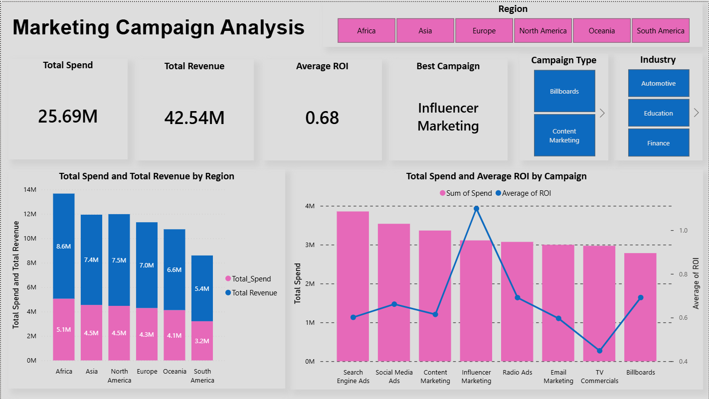
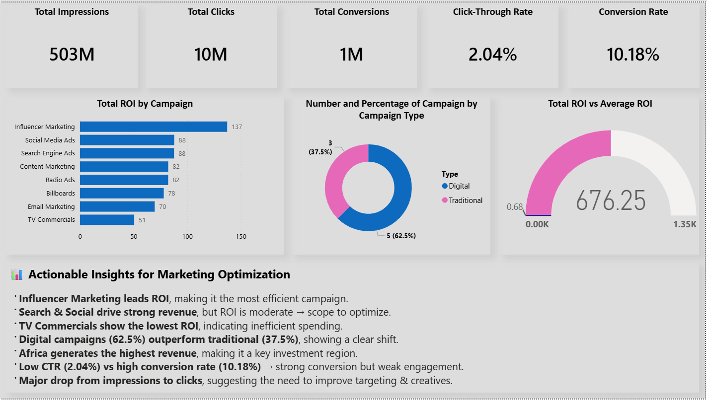

# 📊 Marketing Campaign Analysis Dashboard

## 📌 Project Overview
This project is an interactive Power BI dashboard designed to analyze marketing campaign performance across different regions, industries, and campaign types.

The dashboard provides insights into:
- Revenue generation
- ROI performance
- Conversion metrics
- Campaign effectiveness
- Regional trends

---

## 🛠 Tools & Technologies
- Power BI
- Excel / CSV
- Data Visualization
- Business Analytics

---

## 📈 Key Metrics
- Total Spend: 25.69M
- Total Revenue: 42.54M
- Average ROI: 0.68
- Total Impressions: 503M
- Total Clicks: 10M
- Conversion Rate: 10.18%

---

## 🔍 Key Insights
- Influencer Marketing achieved the highest ROI
- TV Commercials showed the lowest ROI
- Digital campaigns outperformed traditional campaigns
- Africa generated the highest revenue
- Low CTR indicates optimization opportunities

---

## 📸 Dashboard Preview

### Main Dashboard

### Campaign Insights Dashboard

---

## 🚀 Features
- Interactive filters by region, industry, and campaign type
- ROI and revenue analysis
- Campaign performance comparison
- Conversion and engagement analysis
- Actionable business insights

---

## 📂 Files Included
- `.pbix` dashboard file
- CSV datasets
- Dashboard screenshots
- Documentation

---

## 👩‍💻 Author
Sneha Rani Thakur
